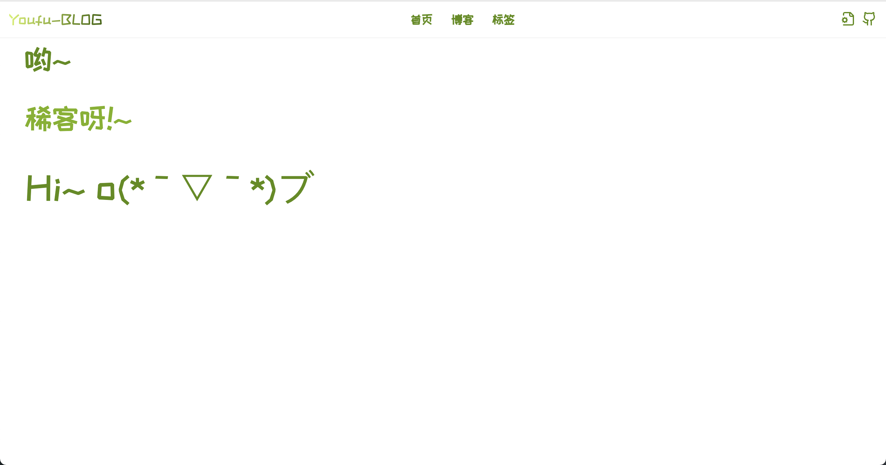
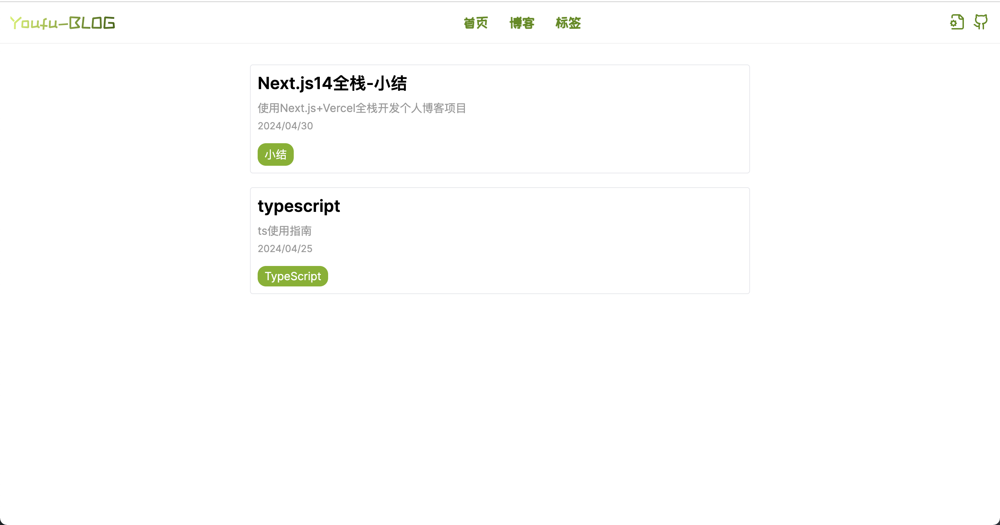
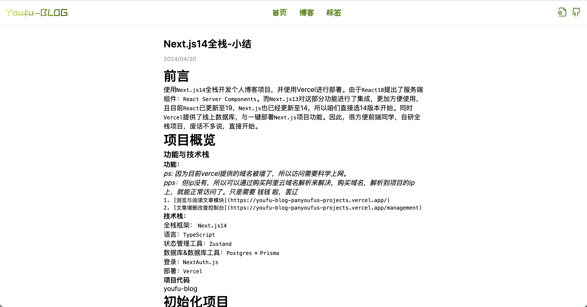
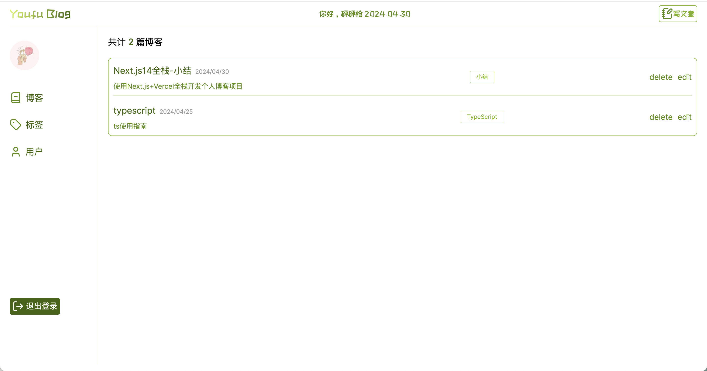
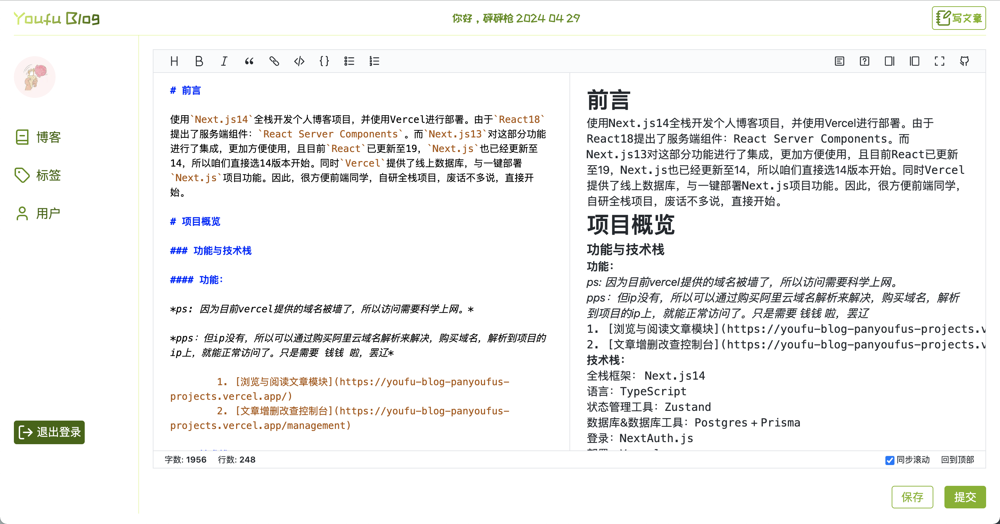
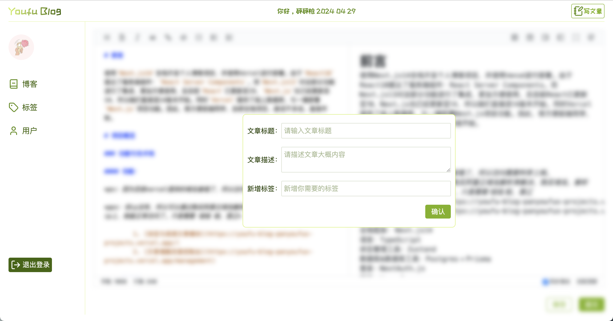

## 简介
使用 Next.js + TypeScript + Vecel 研发部署的个人博客网站。

[小结](./SUMMARY.md)

[细节与填坑](./DETAILS.md)

## 预览

- 预览：（需要科学上网）
  - 前台：https://youfu-blog-panyoufus-projects.vercel.app/
  - 后台管理：https://youfu-blog-panyoufus-projects.vercel.app/management

## 介绍

- 使用 Next.js v14 支持 SSR
- 使用 TypeScript 编写
- 使用 Prisma 简化数据库操作
- 使用 Bytemd 实现 Markdown 的编写和预览
- 使用最新的 next-auth v5 支持 Github 和 Google 登录后台管理
- 集成后台管理功能

## 快速开始
1. 安装依赖

    在项目根目录下运行以下命令安装项目依赖：
    ```bash
    npm install
    ```

2. 数据库启动与同步
    ```bash
    npm run db:gen // Generated Prisma Client 后续可以生成const prisma = new PrismaClient() 实例来操作数据库
    npm run db:studio // 启动一个Web 端的工作台来管理数据
    npm run db:push // 同步数据库
    ```

3. 启动开发服务器

    ```bash
    npm run dev
    ```

4. 预览

- 访问前台: http://localhost:3000
- 访问后台管理: http://localhost:6121/mangement


## 功能
### 前台
首页
 

文章列表页
 

文章详情页
 

### 控制台
登录
 

文章管理列表
 

创建文章
 

发布文章
 

----
MIT
